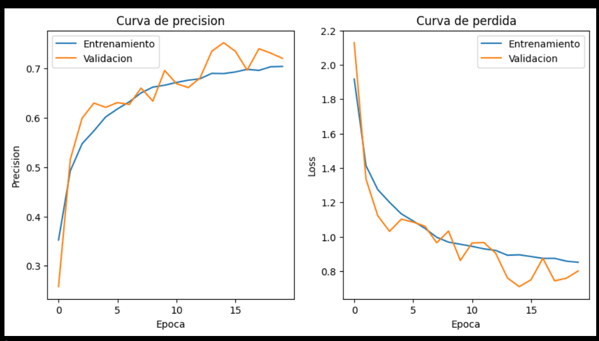

Image Classification with CNN — CIFAR-10  

This project implements a Convolutional Neural Network (CNN) to classify images from the CIFAR-10 dataset, which contains 60,000 images divided into 10 classes.  
The goal is to train a model capable of correctly recognizing the category to which each image belongs (e.g., airplane, car, bird, cat, etc.).  

Dataset: CIFAR-10  
total images: 60,000  
image size: 32x32 pixels (RGB)  
Division:  
    train: 50,000 images  
    test: 10,000 images  

Technologies used:  
    Python 3.10+  
    TensorFlow / Keras  
    Hyperopt  
    NumPy  
    Matplotlib  
    scikit-learn (for metrics)  
    mlflow (for tracking)  

In the project was used Hyperopt to hyperparameter Optimization  
the Optimization focused on parameteres like:  
    learning rate  
    beta1  
    beta2  
which achieves that in just 35 epochs  
the lowest val_loss achieved is: 0.5863434076309204  
and a val_accuracy close to: 0.85  
The best parameters found are: {'beta_1': np.float64(0.8641034119095342), 'beta_2': np.float64(0.9937), 'learning_rate': np.float64(0.0005793436807019373)}  

additionally, in the project was used:  
    Data augmentation to improve model learning  
    ReduceLROnPlateau to avoid training stagnation  
    EarlyStopping to prevent the model from getting stuck or overfitting  

Metrics:

